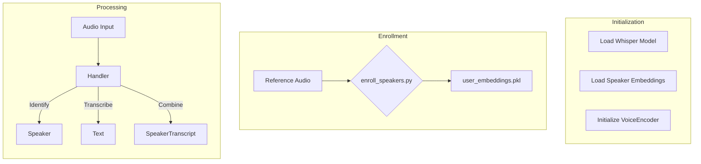

# Speaker Identification Integration Plan

## Goal

Enhance wyoming-faster-whisper to identify speakers in audio clips before transcription, labeling each transcription with its primary speaker.

## Implementation Steps

### 1. Dependency Updates & Dockerization

- Add to `requirements.txt`:
  ```
  resemblyzer
  numpy
  scipy
  ```
- Create `Dockerfile`:
  - Base image: `python:3.11-slim`
  - Install system dependencies (ffmpeg if needed)
  - Copy project code
  - Install Python dependencies
  - Define entrypoint to run service

### 2. Speaker Enrollment (scripts/enroll_speakers.py)

- Processes reference audio files (speaker_name.wav)
- Uses resemblyzer.VoiceEncoder to compute embeddings
- Saves embeddings to data/user_embeddings.pkl
- Manual pre-run step

### 3. Speaker Identification Module (wyoming_faster_whisper/speaker_identifier.py)

- `load_embeddings(path)`: Loads .pkl file
- `identify_speaker(audio_path, embeddings_dict, encoder)`:
  - Computes embedding for incoming audio
  - Finds best match via cosine similarity
  - Returns speaker name (or "unknown")

### 4. Handler Integration (wyoming_faster_whisper/handler.py)

- Modify `__init__` to:
  - Accept embeddings file path
  - Initialize VoiceEncoder
  - Load speaker embeddings
- Modify `handle_event` to:
  - Identify speaker before transcription
  - Create/Send SpeakerTranscript event (speaker + text)

### 5. Entrypoint Updates (**main**.py)

- Add `--embeddings-file` argument
- Pass to handler initialization

### 6. Documentation (README.md)

- Document new feature
- Explain enrollment process
- Update Docker instructions
- Describe new argument

## Runtime Flow


